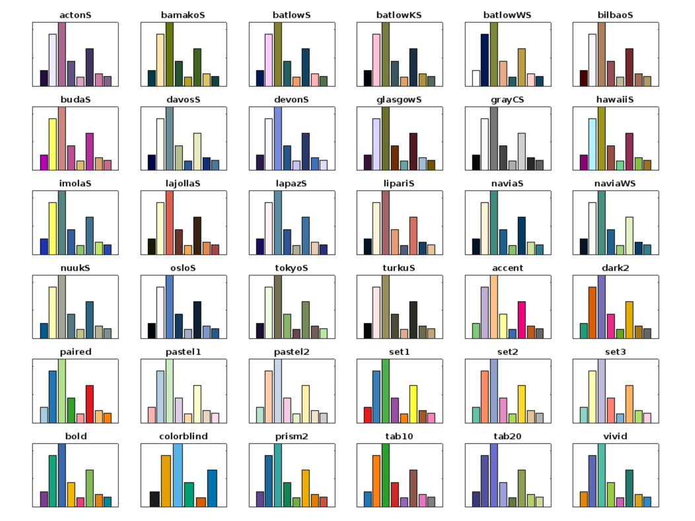

# Categorical Colors
Work with categorical (aka "qualitative") color palettes in MATLAB.

## Features
* Choose from 30 unique color palettes to visualize categorical data.
* Access any of the color palettes using the `cat_colors` function.
* Add a categorical colorbar to figures, with labels, using the `cat_colorbar` function.

## Documentation
See the online **[Wiki](https://github.com/weber1158/categorical-colors/wiki/Documentation)** for documentation of each function.